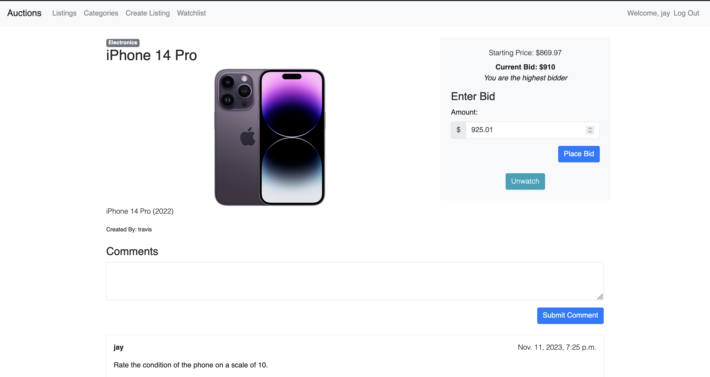

# Auctions

An eBay-like e-commerce auction site that allows users to post auction listings, place bids on listings, comment on those listings, and add listings to a “watchlist".

## Table of Contents

- [About](#about)
- [Features](#features)
- [Technologies Used](#technologies-used)
- [Screenshots](#screenshots)

## About

This web application is designed for people to buy and sell products in an auction setting. Key highlights of the project include:

- Utilizing Python and Django to create the application's back-end.
- Implementing a user-friendly and intuitive UI/UX with HTML, CSS, and JavaScript.
- Enabling users to create listings, bid on listings, and maintain a watchlist.
- Incorporating social features like commenting on listings.

## Features

- **Create Listing**: Users can visit a page to create a new listing.
- **List Creation**: Create and manage a list of items of interest.
- **Social Interaction**: Bid and comment on listings.
- **User-Friendly Interface**: A visually appealing and user-friendly interface for an enjoyable user experience.

## Technologies Used

- Python and Django
- JavaScript
- HTML
- CSS

## Screenshots

